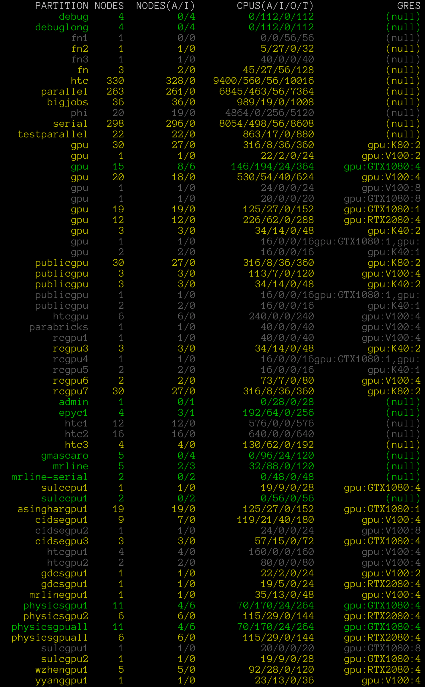

In this section we will take all that we learned thus far and build on
it to run software on [Agave's compute
nodes](https://asurc.atlassian.net/wiki/spaces/RC/pages/45875228/Compute+Nodes).
We will demonstrate some of the basics of interacting with the cluster
and scheduler through the command line, such as using the module file
system or using the `interactive` command.  We are going to take the
commands we repeat frequently and save them in files that can be
submitted to compute nodes for asynchronous completion.  

We will begin by first examining the example workflow that we will be
working with. 

~~~
$ cd ~/Desktop/data-shell/signal
$ ls
~~~
{: .language-bash}

~~~
fft.png  get_fft.py  my_signal_processing_job.sh  signal.dat  signal.png
~~~
{: .output}

In this example, we will be working with some time series data,
specifically that associated with a [triangle wave](https://en.wikipedia.org/wiki/Triangle_wave).
The time series `signal.png` is shown below:

The data associated with this triangle wave is included in `signal.dat`,
and the first ten lines will be outputted to the terminal with `head`:

~~~
$ head signal.dat
~~~
{: .language-bash}

~~~
time                     signal
0.000000000000000000e+00 1.208721311121388364e+00
6.283185307179586614e-03 1.208524005375646748e+00
1.256637061435917323e-02 1.207933122945394233e+00
1.884955592153875897e-02 1.206951758516047635e+00
2.513274122871834645e-02 1.205585037553673411e+00
3.141592653589793394e-02 1.203840068169563127e+00
3.769911184307751795e-02 1.201725874483989820e+00
4.398229715025710196e-02 1.199253312231516322e+00
5.026548245743669291e-02 1.196434967546847306e+00
~~~
{: .output}

A Python file is already provided to compute the [discrete Fourier
transform](https://en.wikipedia.org/wiki/Discrete_Fourier_transform) of
these data, and may be viewed carefully with `nano` or safely with
the read-only pager `less`. The python file requires several modules
including `numpy` and `pylab`, which are not accessible without
appropriately modifying our environment. To demonstrate this, output the
`$PATH` environment variable:

~~~
$ echo $PATH
$ which python
~~~
{: .language-bash}

~~~
/usr/lib64/qt-3.3/bin:/home/rcjdoeuser/perl5/bin:/packages/scripts:/packages/sysadmin/agave/scripts/:/usr/local/cuda/bin:/usr/local/bin:/bin:/usr/bin:/usr/local/sbin:/usr/sbin:/packages/7x/perl5lib/bin:/home/rcjdoeuser/.local/bin:/home/rcjdoeuser/bin

/bin/python
~~~
{: .output}

Note that this **environment variable** contains directories delimited
by a colon character. These are the directories, or **paths**, that the
shell searches for executables when given a command to run. That is, in
the above example, the shell looks for an executable called `echo` first
in `/usr/lib64/qt-3.3/bin` before checking `/usr/local/bin`, where it is
first found. Python exists as an executable by default on Linux systems,
as it is useful and often used for system administration. By running
`which python`, the first instance of `python` as an executable within
the specified `$PATH` is shown: `bin/python`. However, on Agave, the
correct **module** file has to be loaded to properly set up the shell
environment to access the correct scientific python. That is,

~~~
$ module load anaconda/py3
$ echo $PATH
$ which python
~~~
{: .language-bash}

~~~
##############################################                                  
INFORMATION                                                                     
##############################################                                  
                                                                                
You have loaded the base anaconda environment. For specialized environments,    
you must first enable them with `source activate [env]`.                        
                                                                                
For a full list of environments, type `conda env list`     

/packages/7x/anaconda3/5.3.0/bin:/usr/lib64/qt-3.3/bin:/home/rcjdoeuser/perl5/bin:/packages/scripts:/packages/sysadmin/agave/scripts/:/usr/local/cuda/bin:/usr/local/bin:/bin:/usr/bin:/usr/local/sbin:/usr/sbin:/packages/7x/perl5lib/bin:/home/rcjdoeuser/.local/bin:/home/rcjdoeuser/bin

/packages/7x/anaconda3/5.3.0/bin/python
~~~
{: .output}

When the `anaconda/py3` module is loaded, amongst other background processes,
the environment `$PATH` is updated so that the correct scientific python
executable and its libraries are found by the shell first:
`/packages/7x/anaconda3/5.3.0/bin/python`.

> ## Module Environments
>
> Before beginning any scientific workflow, it is recommended to run, 
> `module purge` to reset your environment and prevent any nasty dependency
> clashes. Additionally, to see a list of loaded modules, use `module list`. To
> see all modules available on Agave, use `module avail` or refine your search
> to the software you are interested in by adding it as an additional argument,
> e.g. `module avail matlab`.
{: .callout}

So far, everything we have done has been on a head node, e.g. `agave1`. The
head node is provided mostly for managing compute rather than actively
computing. On the head node, you are limited to a small set of actions, such as
managing the file system, compiling software, or editing software. The main
purpose of the node is to prepare, submit, and track work conducted through the
SLURM scheduler. One of the simplest ways to actually get to a full compute
environment is to use the system administrator provided command: `interactive`.

~~~
$ cd ~/Desktop/data-shell/signal
$ interactive -t 15
~~~
{: .language-bash}

Note that the `-t 15` option is passed to `interactive` to decrease the
potential pending time for this interactive session. By default, `interactive`
will request 1 core for four hours on one of Agave's nodes within the serial
partition. To increase the likelihood of being immediately scheduled, we can
decrease the time being asked for to something more practical for this
exercise, such as 15 minutes, which is what `-t 15` specifically does! When the
above `interactive -t 15` command is submitted, you'll see some fortune text
(some piece of wisdom passed on from system administration), before your
session connects. Once the interactive job begins on a compute node, you'll be
automatically connected. Your prompt should reflect this, changing from 
`[username@head_node_hostname:~/Desktop/data-shell/signal]$` to
`[username@compute_node_hostname:~/Desktop/data-shell/signal]$`. In this
example, `rcjdoeuser` was scheduled on `cg31-1`. To explore this compute node,
consider the following commands:

~~~
$ hostname # prints the compute node's hostname
$ nproc    # prints the number of processors (cores) available
$ free -h  # shows the amount of RAM available and its use on the node in
           # human readable format
$ pwd      # prints the working (current) directory
$ lscpu    # prints more detailed information about the cpu hardware
~~~
{: .language-bash}

~~~
cg31-1.agave.rc.asu.edu 
1
              total        used        free      shared  buff/cache   available
Mem:           187G         27G         77G        1.8G         82G        157G
Swap:           31G         16G         15G
/home/rcjdoeuser/Desktop/data-shell/signal
Architecture:          x86_64
CPU op-mode(s):        32-bit, 64-bit
Byte Order:            Little Endian
CPU(s):                48
On-line CPU(s) list:   0-47
Thread(s) per core:    1
Core(s) per socket:    24
Socket(s):             2
NUMA node(s):          4
Vendor ID:             GenuineIntel
CPU family:            6
Model:                 85
Model name:            Intel(R) Xeon(R) Gold 6252 CPU @ 2.10GHz
Stepping:              7
CPU MHz:               3386.224
CPU max MHz:           3700.0000
CPU min MHz:           1000.0000
BogoMIPS:              4200.00
Virtualization:        VT-x
L1d cache:             32K
L1i cache:             32K
L2 cache:              1024K
L3 cache:              36608K
NUMA node0 CPU(s):     0,4,8,12,16,20,24,28,32,36,40,44
NUMA node1 CPU(s):     1,5,9,13,17,21,25,29,33,37,41,45
NUMA node2 CPU(s):     2,6,10,14,18,22,26,30,34,38,42,46
NUMA node3 CPU(s):     3,7,11,15,19,23,27,31,35,39,43,47
Flags:                 fpu vme de pse tsc msr pae mce cx8 apic sep mtrr pge mca cmov pat pse36 clflush dts acpi mmx fxsr sse sse2 ss ht tm pbe syscall nx pdpe1gb rdtscp lm constant_tsc art arch_perfmon pebs bts rep_good nopl xtopology nonstop_tsc aperfmperf eagerfpu pni pclmulqdq dtes64 monitor ds_cpl vmx smx est tm2 ssse3 sdbg fma cx16 xtpr pdcm pcid dca sse4_1 sse4_2 x2apic movbe popcnt tsc_deadline_timer aes xsave avx f16c rdrand lahf_lm abm 3dnowprefetch epb cat_l3 cdp_l3 invpcid_single intel_ppin intel_pt ssbd mba ibrs ibpb stibp ibrs_enhanced tpr_shadow vnmi flexpriority ept vpid fsgsbase tsc_adjust bmi1 hle avx2 smep bmi2 erms invpcid rtm cqm mpx rdt_a avx512f avx512dq rdseed adx smap clflushopt clwb avx512cd avx512bw avx512vl xsaveopt xsavec xgetbv1 cqm_llc cqm_occup_llc cqm_mbm_total cqm_mbm_local dtherm ida arat pln pts pku ospke avx512_vnni md_clear spec_ctrl intel_stibp flush_l1d arch_capabilities
~~~
{: .output}

Let's run the python `fft` script from this interactive session. All we need to
do is set up the appropriate environment and run the script.

~~~
$ module purge               # reset the environment 
$ module load anaconda/py3   # reset the environment 
$ python get_fft.py          # run the python code
$ mail -a fft.png -s "FFT RESULTS" "${USER}@asu.edu" <<< "SEE ATTACHED"
~~~
{: .language-bash}

The result is `fft.png`, demonstrating the expecting Fourier spectra of the
triangle wave:

> ## The interactive command
>
> The command `interactive` is really a bash wrapper around SLURM's provided
> scheduler command ,`sbatch`. On Agave, `interactive` has the following defaults:
> - partition: `serial`
> - qos: `normal`
> - walltime: `0-4` (4 hours)
> - cores: 1
> - output: `/dev/null` (output messages are thrown away)
> - error: `/dev/null` (error messages are thrown away)
> The defaults, as indicated, may be customized by passing the appropriate
> `sbatch` options. A full list may be obtained through the manual page: `man
> sbatch`, but a few common ones are indicated here:
> - specify `serial` partition: `-p serial`
> - specify `normal` qos: `-q normal`
> - specify one hour wall time: `-t 0-1` or `-t 60` or many other ways
> - specify four cores: `-c 4`
> - specify output file:  `-o <path>`
> - specify error  file:  `-e <path>`
> This will be examined in more detail in the `sbatch` section.
{: .callout}

After a while of getting comfortable with interactive sessions, you may find
yourself wishing there was a way to automate your actions. The good news is
that your workflow is likely fully scriptable, and that it just requires a bit
of scheduler wrapping to successful batch process. We will use the previous
example to demonstrate with the file `data-shell/signal/my_signal_processing_job.sh`, which contains:

~~~
#!/bin/bash
#SBATCH -p serial
#SBATCH -q normal
#SBATCH -t 5
#SBATCH -c 1
#SBATCH -e signal_processing_job.%j.err
#SBATCH -o signal_processing_job.%j.out
#SBATCH --mail-type=ALL
#SBATCH --mail-user=%u+agave+cli+example@email.asu.edu

# Grab node information if desired (note a lot of this is recorded by
# slurm already)
echo hostname: $(hostname)
echo    nproc: $(nproc)
echo     free: $(free -h)
echo      pwd: $(pwd)
# Purge any loaded modules to ensure consistent working environment
module purge
# Load required software
module load anaconda/py3
# Diagnostic information
module list
which python
# Put bash into a diagnostic mode that prints commands
set -x
# Starting
echo STARTED: $(date)
# Run scientific workflow
python get_fft.py
# Send output figure to researcher email
mail -a fft.png -s "fft complete" "${USER}@email.asu.edu" <<< "SEE ATTACHED
# Finished
echo FINISHED: $(date)
~~~
{: .language-bash}

To submit this job, use `sbatch` (submitted as user `jyalim`):

~~~
$ sbatch my_signal_processing_job.sh
~~~
{: .language-bash}

~~~
Submitted batch job 4967966
~~~
{: .output}

The **job id** that `sbatch` reports is a unique integer associated with your
job. This job id may be used to track the status of the job in the queue with a
variety of commands, such as `myjobs` or even more specifically `thisjob <jobid>`:

~~~
$ thisjob 4967966
~~~
{: .language-bash}

~~~
JOBID      PARTITION NAME               USER           STATE        TIME         TIME_LIMIT   CPUS  NODELIST(REASON)
4967966    serial    my_signal_processi jyalim         PENDING      0:00         5:00         1     (Priority)

JobId=4967966 JobName=my_signal_processing_job.sh
   UserId=jyalim(513649) GroupId=jyalim(513649) MCS_label=N/A
   Priority=77096 Nice=0 Account=jyalim QOS=normal WCKey=*
   JobState=PENDING Reason=Priority Dependency=(null)
   Requeue=0 Restarts=0 BatchFlag=1 Reboot=0 ExitCode=0:0
   RunTime=00:00:00 TimeLimit=00:05:00 TimeMin=N/A
   SubmitTime=2020-08-17T14:42:06 EligibleTime=2020-08-17T14:42:06
   AccrueTime=2020-08-17T14:42:06
   StartTime=Unknown EndTime=Unknown Deadline=N/A
   SuspendTime=None SecsPreSuspend=0 LastSchedEval=2020-08-17T14:42:06
   Partition=serial AllocNode:Sid=agave3:95946
   ReqNodeList=(null) ExcNodeList=(null)
   NodeList=(null)
   NumNodes=1 NumCPUs=1 NumTasks=1 CPUs/Task=1 ReqB:S:C:T=0:0:*:*
   TRES=cpu=1,mem=4594M,node=1,billing=1
   Socks/Node=* NtasksPerN:B:S:C=0:0:*:* CoreSpec=*
   MinCPUsNode=1 MinMemoryCPU=4594M MinTmpDiskNode=0
   Features=GenCPU DelayBoot=00:00:00
   OverSubscribe=OK Contiguous=0 Licenses=(null) Network=(null)
   Command=/home/jyalim/.local/src/hellabyte/agave-shell-novice/data-shell/signal/my_signal_processing_job.sh
   WorkDir=/home/jyalim/.local/src/hellabyte/agave-shell-novice/data-shell/signal
   StdErr=/home/jyalim/.local/src/hellabyte/agave-shell-novice/data-shell/signal/signal_processing_job.4967966.err
   StdIn=/dev/null
   StdOut=/home/jyalim/.local/src/hellabyte/agave-shell-novice/data-shell/signal/signal_processing_job.4967966.out
   Switches=1@1-00:00:00
   Power=
~~~
{: .output}

The command `myjobs` is an admin provided wrapper around SLURM's `squeue`, which outputs information about only your jobs:

~~~
$ myjobs
~~~
{: .language-bash}

~~~
JOBID      PARTITION NAME               USER           STATE        TIME         TIME_LIMIT   CPUS  NODELIST(REASON)
4967966    serial    my_signal_processi jyalim         PENDING      0:00         5:00         1     (Priority)
~~~
{: .output}

Note that `myjobs` is roughly equivalent to `squeue -u $USER` (the formatted
outputs are different).

When scheduling jobs, it can be useful to gauge the activity on the cluster's
various partitions. The command `showparts` will provide a quick color-coded overview of partition status:

~~~
$ showparts
~~~
{: .language-bash}

Green is used to indicate a full node is available within the parititon, yellow
to indicate available cores, and gray to indicate total allocation.

Another useful resource is the [cluster status page](https://rcstatus.asu.edu/agave/smallstatus.php).

> ## Cancelling jobs
>
> The SLURM command `scancel` is one of the more important scheduler commands
> to know. In its simpliest application, you may pass the job ids you'd like to
> cancel, e.g. `scancel 4967966`. However, `scancel` can accept options to
> cancel all jobs associated with username, partitions, qos, state,and more.
> For instance, if issued by an admin or the user, `scancel -u jyalim` would
> cancel all jobs associated with that user. See `man scancel`.
{: .callout}
